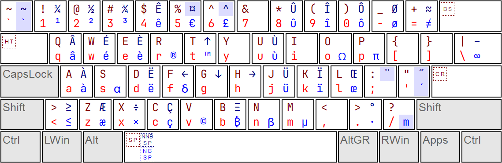
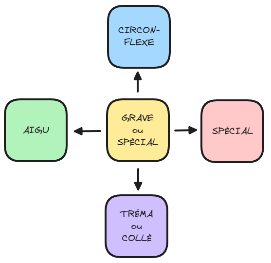
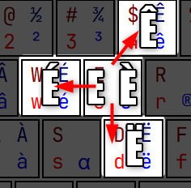
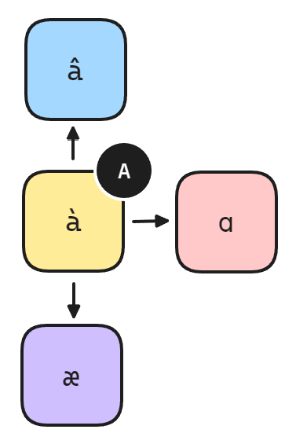
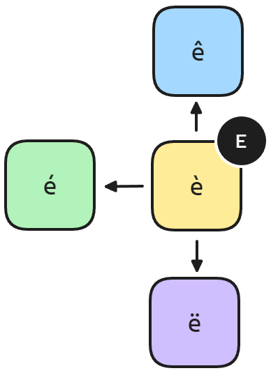
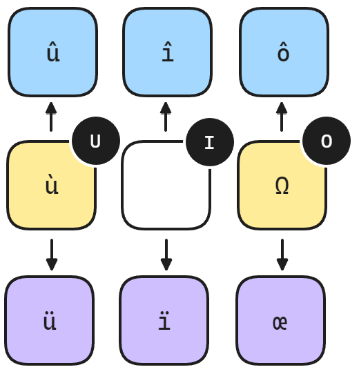
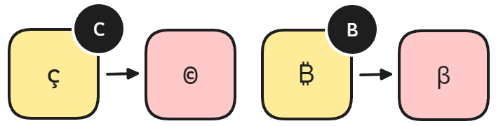

# French (QWERTY-FRANÇAIS)

Clavier français QWERTY.

# Motivation

Le clavier français officiel est l'AZERTY. Cependant, étant développeur et écrivant beaucoup de texte en anglais, j'ai toujours préféré le clavier QWERTY. Le problème est que le clavier QWERTY n'est pas adapté à la langue française. Si vous êtes comme moi, vous utilisez probablement le clavier US International qui demande d'utiliser de nombreuses touches mortes pour écrire en français. C'est un peu pénible.

Utiliser le QWERTY, c'est également utiliser un clavier tout simplement mieux pensé. Par exemple, les parenthèses et les crochets sont plus faciles à mémoriser car ils sont côte à côte. Aussi, le QWERTY est plus largement compatible, notamment dans les jeux-vidéo qui ne supportent pas toujours l'AZERTY.

L'AZERTY n'est d'ailleurs pas tant bien que ça adapté à la langue française. Avec QWERTY-FRANÇAIS, je tape `œ` ou `æ` avec un simple raccourci facilement mémorisable. Je peux également accentuer les majuscules, ce qui est impossible ou compliqué avec l'AZERTY.

Avec QWERTY-FRANÇAIS, je peux taper des symbôles de monnaies comme la livre sterling `£` ou le yen `¥` mais aussi des symbôles plus modernes comme celui du bitcoin `₿`. Je peux taper des flèches dans les quatre directions `↑←↓→` en une fraction de seconde... et tout cela est facilement mémorisable !

# Ecrire avec QWERTY-FRANÇAIS

Voici la disposition QWERTY-FRANÇAIS.

# Comment mémoriser facilement le QWERTY-FRANÇAIS ?

Le layout QWERTY-FRANÇAIS est facile à apprendre grâce à son système de clusters. Comme stipulé plus haut, il suffit de retenir la direction à partir d'un caractère donné pour obtenir une version alternative en appuyant sur `AltGr`. Le comportement est toujours le même.

- Sur la touche, ce sera soit le caractère avec un accent grave ou un caractère spécial qui fait penser au caractère de base
- A gauche, ce sera toujours le caractère avec un accent aigu
- Au dessus, ce sera toujours le caractère avec un accent circonflexe
- En dessous, ce sera soit le caractère avec un tréma ou la version "collée" (soit `æ` ou `œ`)
- A droite, ce sera un caractère spécial qui fait penser au caractère de base

Taper les caractères les plus courants de la langue française est donc d'une grande simplicité. Voici un exemple avec la lettre E.

Tous les caractères n'ont pas besoin d'accent aigu, grave, circonflexe et tréma. Si vous tapez sur une touche avec `AltGr` et que le résultat n'est pas parmi les règles ci-dessus, c'est qu'il n'est pas utilisé dans la langue française. Par exemple, si vous tapez `AltGr` + `U`, vous obtiendrez `ù` mais cela ne fonctionne pas pour `AltGr` + `O` vu que `ò` n'est pas utilisé dans la langue française. Ainsi, la règle des caractères spéciaux permet de le remplacer par le symbôle `omega` `Ω` (_un caractère spécial qui fait penser au caractère de base_).

## Le cluster A

Le cluster A fonctionne de manière normale pour `à` (`AltGr` + `A`) et `â` (`AltGr` + `Q`). A droite, vous obtiendrez `alpha` `ɑ` et en dessous, le caractère `æ`.

.

## Le cluster E

Le cluster E est le plus simple. Comme expliqué dans l'exemple précédent.

.

## Les cluster U, I et O

Les clusters U, I et O fonctionnent de manière similaire. Ils disposent tous de leur version avec accent circonflexe au dessus. En dessous, le tréma est utilisé. Seul le cluster O fait exception avec `Ω` et `œ` en dessous.

.

## Les autres clusters

Presque toutes les touches du clavier s'inspirent de ce système de cluster pour vous aider à les mémoriser. Les clusters C et B sont deux bons exemples. B a deux caractères spéciaux `₿` (bitcoin) et `ꞵ` (beta). Tandis que C a `ç` (c cédille) et `©` (copyright).

.

# Notes sur le projet QWERTY-FR

Ce clavier a été créé pour être le plus simple possible. Il est destiné au personnes qui tapent en français et en anglais. Si vous souhaitez supporter plus de langues, je vous invite à vous rendre sur le projet qui a largement inspiré celui-ci : [qwerty-fr](https://github.com/qwerty-fr/qwerty-fr) créé par Paul @devnoname120. Note que ce projet n'est pas un fork. J'ai repris le projet à zéro.

## QWERTY-FRANÇAIS est Immuable

Cette disposition est **immuable** (à partir de la fin des versions notées "pré-version"). La version originale du projet a déplacé certaines touches comme les `ê` ce qui me semble une abberation. Les seules autorisations de modification seront donc les ajouts là où il y a encore de la place.

## QWERTY-FRANÇAIS est Francophone

QWERTY-FRANÇAIS est davantage destiné aux francophones. A trop vouloir contenter de langues, je pense que le projet original s'est petit à petit éloigné de son intérêt de base, à savoir simplifier la saisie de texte en français.
